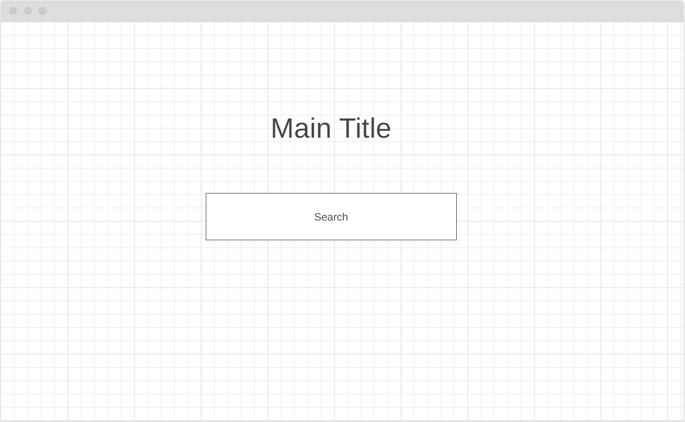
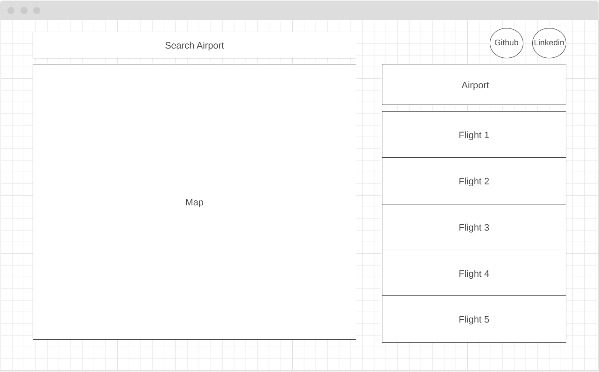
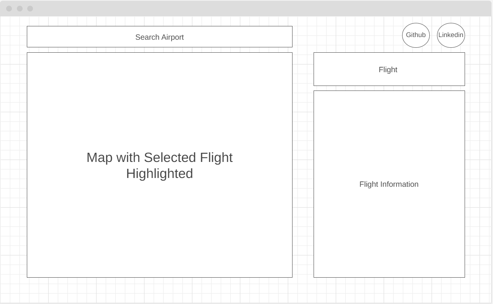

<!-- **Background** 

SkyView is a website that allows users to search for flight information at a specific airport. Upon selecting an airport, users will be able to select a particular flight to see the current location of the flight and its path to the airport.

**Functionality**

In SkyView, users will be able to:

* **Search:** Search flights by airport.
* **View Map:** Visualize flights on the map around the airport.
* **Select Flight:** Highlight a particular flight on the map.
* **View Flight Details:** See specific details regarding the selected flight aircraft.

**Wireframes**

Below is a basic search page that allows a user to search for flights going to or departing from a specific airport.



Below is the main page of the website after utilizing the search feature. It includes a map, a search bar, and flights to choose from.



Below is the main flight page of the website after selecting a flight from the previous main page. 



**Technologies**

* **OpenSky Network API:** API to fetch flight data
* **d3.js:** Library to create map and charts

**Implementation Timeline**

* Friday Morning & Weekend: Initial setup, familiarize with API and test API. Ensure working search functionality.
* Monday: Create basic website skeleton. Utilize d3.js library to create map.
* Tuesday: Ensure working flight information is displayed. Display of map onto website.
* Wednesday: Finishing touches to map.
* Thursday Morning: Last minute UI checks. -->

**<h1>SkyView</h1>
SkyView is a single-page application that visualizes the flight paths of planes that have departed from a user searched airport.

**<h2>Live Link</h2>**
[https://wleung4.github.io/skyview/](https://wleung4.github.io/skyview/)

<h2>Instructions</h2>

* Enter any airport name into the search bar.
* Submit the airport name or click on the any of the airport names in the results .
* After the map and the table appear, click on any of the plane numbers highlighted in blue a path for the flight path will be drawn.
* You can zoom in and zoom out of the map as well as move around the map by dragging the map.
* To search for another airport, click on the search again button on the top left of the website.

**<h2>Technologies Used</h2>**
* API Data provided by [The Open Sky Network](https://opensky-network.org)
* Map created using d3 Library [d3.org](https://d3js.org/) 
* Webpack Module Bundler [Webpack](https://webpack.js.org/)
* npm Package Manager [npm](https://www.npmjs.com/)

**<h2>Technical Implementation</h2>**
Upon entering the landing page, a search bar is shown. After the user stops typing, the csv containing all airport information is parsed and a search is performed onto the input. Resulting matches is put into a function to generate results. To achieve this result, my function removed the child nodes attached to the document element and then appended new nodes for airport names that match the user input. 

```javascript
const addResults = (matches) => {
	while(searchResults.firstChild){
		searchResults.removeChild(searchResults.firstChild);
	}
	matches.forEach(match => {
		const result = document.createElement("div");
		result.textContent = match;
		result.addEventListener("click", (e)=> {
			e.stopPropagation();
			searchValue.value = result.textContent;
		});
		searchResults.appendChild(result);
	});
	searchResults.style.display = "block";
}
```
Below is a gif of how the searching works and how the results are shown.


After the airport is submitted, a map is generated using the javascript library d3.js. The airport name that is entered would be put into the Open Sky Network API. Using the response from the API, a table is generated based upon the past 6 hours of departing flights. Upon clicking the flight number, the API is to get back the flight pathing information. After that, a line path is drawn onto the map. There is a reset button on the top left to take you back to the search page.<br>
<br>
Below is a gif of how the map and table look upon submit of airport and how clicking the planes creates line paths for the plane.


**<h2>To Do/Additional Features </h2>**
* Add plane history data underneath map and flight table
* Swap to API with more up to date flight information regarding arrivals and locations

